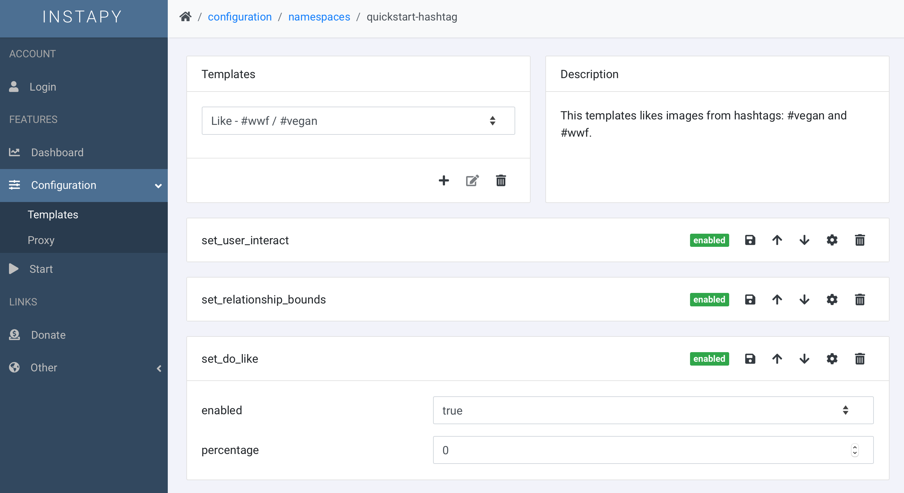

<p align='center'>
	<h1 align='center'>InstaPy GUI</h1>
	<p align='center'>Graphical User Interface for <a href='https://github.com/timgrossmann/InstaPy'>InstaPy</a> Automation including some useful Analytics.<p>
	<p align='center'>
		<a href='https://travis-ci.com/breuerfelix/instapy-gui'>
			
		</a>
		<a href='https://discord.gg/FDETsht'>
			
		</a>
		<a href='https://www.github.com/timgrossmann/InstaPy#backer'>
			
		</a>
		<a href='https://www.github.com/timgrossmann/InstaPy#sponsors'>
			
		</a>
		<a href='https://github.com/breuerfelix/instapy-gui/blob/master/LICENSE'>
			
		</a>
	</p>
</p>

## installation

### requirements

* install [python 3](https://www.python.org/downloads/)
* sign up on [instapy.io](https://instapy.io)
* install [firefox](https://www.mozilla.org)

### register a bot

#### windows-1-click-install

* download [update.bat](https://raw.githubusercontent.com/breuerfelix/instapy-gui/master/services/instapy/update.bat) and save it
  * you can copy your old assets folder into this folder aswell to reuse your database / cookies / etc.
* double-click `update.bat`
* double-click `setup.bat`
  * answer all the questions
* double-click `startClient.bat` To take off!

#### linux/mac-1-click-install

* download [update.sh](https://raw.githubusercontent.com/breuerfelix/instapy-gui/master/services/instapy/update.sh) and save it
  * you can copy your old assets folder into this folder aswell to reuse your database / cookies / etc.
* execute `bash update.sh`
* execute `bash setup.sh`
  * answer all the questions
* execute `bash startClient.sh` To take off!

#### docker

create a file named `instapy.env` with the following content:

```env
INSTAPY_USER=instapy.io_username
INSTAPY_PASSWORD=instapy.io_password
IDENT=choose_any_name_to_indentify_this_instance
```

execute the following command:

```bash
sudo docker run -d --env-file instapy.env --name instapyclient felixbreuer/instapy-client
```

remember that you can only run docker clients in headless mode.

#### step-by-step guide

* download [all files here](https://github.com/breuerfelix/instapy-gui/tree/master/services/instapy) and save them to a folder on your system
  * you can copy your old assets folder into this folder aswell to reuse your database / cookies / etc.
* navigate to the folder in the console
  * you could create a new python [virtual environment](https://packaging.python.org/guides/installing-using-pip-and-virtual-environments/) here _(optional)_
* run `pip install -r requirements.txt`
  * use `pip3` if you are on linux or mac
* create a file named `.env` or `instapy.env` with the following content

```env
INSTAPY_USER=instapy.io_username
INSTAPY_PASSWORD=instapy.io_password
IDENT=choose_any_name_to_indentify_this_instance
```

* run `python start.py`
  * use `python3` if you are on linux or mac
* go to [instapy.io](https://instapy.io) and take off!

##### adjustments for raspberry pi

* activate the virtual enviroment
* run following commands in the console

```bash
python3 -m pip uninstall instapy-chromedriver
python3 -m pip install --user instapy-chromedriver==2.36.post0
```

if this is not working try the following:

* cd into instpay-client folder

```bash
mkdir assets && cd assets
wget https://github.com/electron/electron/releases/download/v3.0.0-beta.5/chromedriver-v3.0.0-beta.5-linux-armv7l.zip
unzip chromedriver-v3.0.0-beta.5-linux-armv7l.zip
chmod 755 chromedriver
chmod +x chromedriver
sudo apt-get remove chromium
```

### register more bots

if you are on a different machine just follow the steps [register a bot](#register-a-bot) again.

* copy the whole client folder to a different folder
* edit `.env` or `instapy.env`
  * change `IDENT=...` to something new
* start the new client
* in the start panel of instapy.io you now have 2 bots in the select bot dropdown menu

## guides

**[how to start contributing](docs/contributing.md)**

### video tutorials

**[complete guide to bot creation](https://www.udemy.com/course/the-complete-guide-to-bot-creation/?referralCode=7418EBB47E11E34D86C9)**  
**[full manual installation on windows 10](https://drive.google.com/open?id=1ZafLOa0ShSXva61eQwFAePSVBC0Suc9p) by [@LexLinux](https://github.com/lexlinux)**  
**[1-click installation on windows 10](https://streamable.com/6h6d8) by [@HCWcoder](https://github.com/HCWcoder)**  
**[official instapy guide on udemy](https://www.udemy.com/instapy-guide/?couponCode=INSTAPY_OFFICIAL)**

## screenshots

  


## roadmap

* scheduler
* change account info
* forgot password
* analytics

## support

### troubleshoot

#### no module named 'pip'

* run `curl https://bootstrap.pypa.io/get-pip.py -o get-pip.py`
* execute the downloaded file
  * on linux or mac run `./env/bin/python3 get-pip.py`
  * on windows run `.\env\Scripts\python.exe get-pip.py`
* reinstall the requirements
  * on linux or mac run `./env/bin/pip3 install -r requirements.txt`
  * on windows run `.\env\Scripts\pip.exe install -r requirements.txt`

#### certificate verify failed

in the client after `logged in with user: <username>` you get the following error:

```error
certificate verify failed: unable to get local issuer certificate
```

please have a look at [this](https://stackoverflow.com/questions/52805115/certificate-verify-failed-unable-to-get-local-issuer-certificate) stack overflow post to resolve the issue.

#### global name 'f' is not defined

```error
Traceback (most recent call last):
File "start.py", line 175, in
TOKEN = get_token(username, password)
File "start.py", line 64, in get_token
print(f,"authenticate {username} to {url} ...")
NameError: global name 'f' is not defined
```

you need to use python version `3.6` or higher. the f-string format got implemented in that version.

### do you need help ?

if you should encounter any issue, please first [search for similar issues](https://github.com/breuerfelix/instapy-gui/issues) and only if you can't find any, create a new issue or use the [discord channel](https://discord.gg/FDETsht) for help.

<a href='https://discord.gg/FDETsht'>
  
</a>

### do you want to support us ?

<a href="https://opencollective.com/instapy/donate" target="_blank">
  
</a>

---

**disclaimer:** please note that this is a research project. i am by no means responsible for any usage of this tool. use on your own behalf. i am also not responsible if your accounts get banned due to extensive use of this tool.

---

_we love lowercase_
