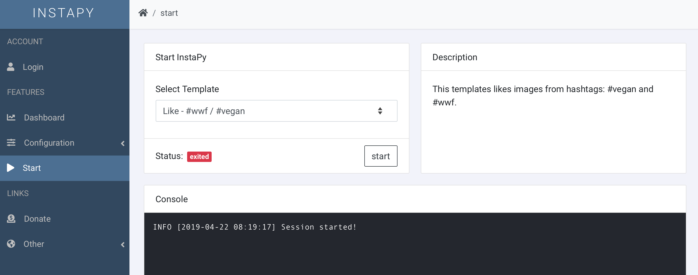

<p align='center'>
	<h1 align="center">InstaPy GUI</h1>
	<p align="center">Graphical User Interface for <a href='https://github.com/timgrossmann/InstaPy'>InstaPy</a> Automation including some useful Analytics.<p>
	<p align="center">
		<a href="https://travis-ci.com/breuerfelix/instapy-gui">
		
		</a>
		<a href="https://discord.gg/FDETsht">
		
		</a>
		<a href="https://www.github.com/timgrossmann/InstaPy#backer">
		
		</a>
		<a href="https://www.github.com/timgrossmann/InstaPy#sponsors">
		
		</a>  
		<a href="https://github.com/breuerfelix/instapy-gui/blob/master/LICENSE">
		
		</a>
	</p>
</p>

## installation

### requirements

* install [python 3](https://www.python.org/downloads/)
* sign up on [gui.instapy.io](http://gui.instapy.io)

### register a bot

* download [all files here](https://github.com/breuerfelix/instapy-gui/tree/feature/auth-service/services/instapy) and save them to a folder on your system
* navigate to the folder in the console
* run `pip install -r requirements.txt`
  * use `pip3` if you are on linux or mac
* create a file named `.env` with the following content

```env
USERNAME=instapy.io_username
PASSWORD=instapy.io_password
IDENT=choose_any_name_to_indentify_this_instance
```

* run `python start.py`
  * use `python3` if you are on linux or mac
* go to [gui.instapy.io](http://gui.instapy.io) and take off!

## guides

### video tutorials:

**[official instapy guide on udemy](https://www.udemy.com/instapy-guide/?couponCode=INSTAPY_OFFICIAL)**

## screenshots

  


## support

### do you need help ?

if you should encounter any issue, please first [search for similar issues](https://github.com/breuerfelix/instapy-gui/issues) and only if you can't find any, create a new issue or use the [discord channel](https://discord.gg/FDETsht) for help.

<a href='https://discord.gg/FDETsht'>
  
</a>

### do you want to support us ?

<a href="https://opencollective.com/instapy/donate" target="_blank">
  
</a>

---

_we love lowercase_
